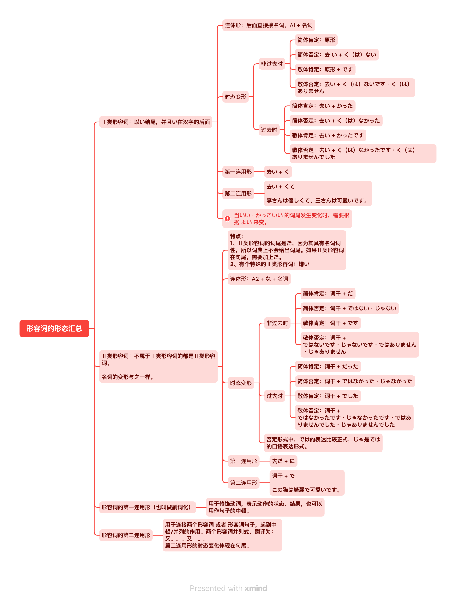

# 形容词

表示人或事物的性质或状态的词称为 **`形容词`**。具有 <u>[活用](./term/flexibleUse.md)</u> 变化。

形容词由两部分组成： `词干` 以及 `词尾`。其中：

<grammer-content sentence="**一类形容词** 的词尾为 **「い」**： **[面白/おもし](词干) + い(词尾)**。" />
<grammer-content sentence="**二类形容词** 的词尾为 **「だ」**， 但是**一般会省略**，只有当**以二类形容词结句（即二类形容词放在句尾）时**，需要加上 「だ」。如果使用的是敬体形式，则不需要加 「だ」，而是以 **「です」** 结句。： **[綺麗/きれい](词干) + (だ)(词尾, 省略)**。" />

## 形容词的分类

### 一类形容词

以 **`「い」`** 结尾，并且 **`「い」`** 在汉字的后面的形容词为 **`一类形容词`**。

<grammer-content sentence="例如： **[面白/おもし]い、[大/おお]きい、[辛/から]い、[暑/あつ]い** 等等；" />

### 二类形容词

一类形容词以外的其他形容词都是 **`二类形容词`**。

<grammer-content sentence="例如：**[綺麗/きれい]、[立派/りっぱ]** 等等。" />

::: danger 注意：

有个词比较特殊： **嫌い**， 虽然它看上去是一类形容词，实际上它是二类形容词，这个需要特殊注意下！！

:::

## 形容词的<u>[连体形](./term/ltForm.md)</u>

### 一类形容词的连体形

接续：`形容词原形 + 名词`。因此，一类形容词也被称作 `イ形容词`。

::: info 例句

<grammer-content sentence="[図書館/としょかん]はあの**[白/しろ]い[建物/たてもの]**です。" trans="那栋建筑是图书馆。" />

:::

### 二类形容词的连体形

接续：`形容词词干 + な + 名词`。因此，二类形容词也被称作 `ナ形容词`。

::: info 例句

<grammer-content sentence="**[立派/りっぱ]な[図書館/としょかん]**ですね。" trans="真是个气派的图书馆啊。" />

:::

## 形容词的<u>[连用形](./term/lyx.md)</u>

形容词的连用形主要分为以下两类：

- 第一连用形：也叫做 `形容词的副词化`，用于修饰动词，表示动作的 `状态、结果`，也可以用作句子的中顿；
- 第二连用形：用于连接两个 `形容词` 或 `形容词句子`，起到中顿、并列的作用，译作 `又...又...`。需要注意的是，第二连用形的时态变化体现在 **句尾**。

::: danger 注意

只有一类形容词的两种连用形可以同时用于中顿并列，而二类形容词只有第二连用形可以用于中顿并列！

:::

形容词连用形的变化规律如下：

### 一类形容词连用形

| 连用形 | 变形规律 | 例句 |
| :-----------: | :-----------: | :-----------: |
| 第一连用形     | 去い + く    | <grammer-content sentence="**[面白/おもしろ]くない**[結論/けつろん]が[出/で]る。" trans="得出不称心的结论。" />     |
| 第二连用形     | 去い + くて       | <grammer-content sentence="[李/り]さんは**[優/やさ]しくて**、[王/おう]さんは[可愛/かわい]いです。" trans="小李很温柔，小王很可爱。" />      |

### 二类形容词连用形

| 连用形 | 变形规律 | 例句 |
| :-----------: | :-----------: | :-----------: |
| 第一连用形     | 词干 + に       | <grammer-content sentence="**[綺麗/きれい]に**[食/た]べる。" trans="吃得一点不剩。" />     |
| 第二连用形     | 词干 + で       | <grammer-content sentence="この[猫/ねこ]は**[綺麗/きれい]で**[可愛/かわい]いです。" trans="这只猫又漂亮又可爱。" />     |

## 形容词的变形

### 非过去时

| 形容词类型 | 简体肯定 | 简体否定 | 敬体肯定 | 敬体否定 |
| :-----------: | :-----------: | :-----------: | :-----------: | :-----------: |
| 一类     | 原形       | 去 い + く(は)ない      | 原形 + です       | 去い + く(は)ないです 去い + く(は)ありません      |
| 二类     | 词干 + だ       | 词干 + ではない 词干 + じゃない      | 词干 + です       | 词干 + ではないです 词干 + じゃないです 词干 + ではありません 词干 + じゃありません      |

### 过去时

| 形容词类型 | 简体肯定 | 简体否定 | 敬体肯定 | 敬体否定 |
| :-----------: | :-----------: | :-----------: | :-----------: | :-----------: |
| 一类     | 去い + かった       | 去い + く(は)なかった      | 去い + かったです       | 去い + く(は)なかったです 去い + く(は)ありませんでした      |
| 二类     | 词干 + だった       | 词干 + ではなかった 词干 + じゃなかった      | 词干 + でした       | 词干 + ではなかったです 词干 + じゃなかったです 词干 + ではありませんでした 词干 + じゃありませんでした      |

## 形容词的形态汇总

