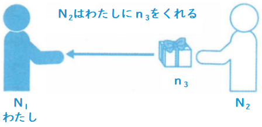
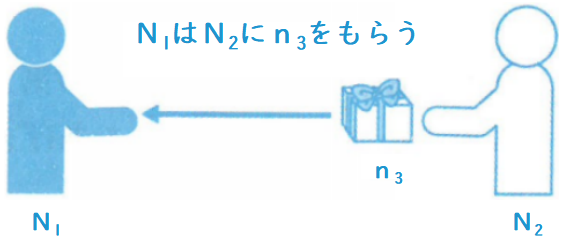

# あげる/くれる/もらう ＜授受＞

* <grammer-content sentence="意义：表达人与人之间**物品**的授受；" />
* 译文：给；得到

::: tip :bookmark: 说明

あげる/くれる/もらう 三个动词统称为 `授受动词`。但是授受动词有人称上的限制。下面分别来进行说明。

:::

::: info :books: 1. あげる

用于表示`说话人`或`在心理上属于说话人一方的人`将物品赠予他人，`接受方`用格助词`「に」`表示。这个句式是`侧重于赠予者的表达方式`。

**<grammer-content sentence="接续方式为： N1〈赠予〉は N2〈接受者〉に n3〈所赠物品〉を + **あげる**" />**

授受关系可以参考下图：

上图所表达的授受关系可以简单的归纳为：`我给别人，我方给别人，别人给别人`。

1. <grammer-content id='1-12-06-0' sentence="いろいろな[男/おとこ]の[人/ひと]が（[かぐや姫/かぐやひめ]に）プレゼントを**あげました**。**(第三者 ⇒ 第三者)**" trans="各种各样的男人送了辉夜姬礼物。" />
2. <grammer-content id='1-12-06-1' sentence="[私/わたし]は[恋人/こいびと]に[花/はな]を**あげました**。**(说话人 ⇒ 第三者)**" trans="我给对象送了花。" />
3. <grammer-content id='1-12-06-2' sentence="[王/おう]さん、[母/はは]の[日/にち]に[何/なん]かプレゼントを**あげますか。(听话人 ⇒ 第三者)**" trans="小王，母亲节送什么礼物呢。" />

::: danger :warning: 注意

接受者的角色`不可以是说话人这一方`！！比如下句就是错误的表达：

<grammer-content sentence="[田中/やまだ]さんは[私/わたし]にプレゼントをあげました。❌" />

:::

::: info :books: 2. くれる

用于表示`他人将物品赠予说话人或在心理上属于说话人一方的人`，`接受方`用格助词`「に」`表示。当`接受方为说话人（第一人称）时，经常省略`。这个句式是`侧重于接受方`的表达方式。

**<grammer-content sentence="接续方式为： N2〈赠予者）は N1〈接受者〉に n3〈所赠物品〉を + **くれる**" />**

授受关系可以参考下图：

上图所表示的授受关系可以简单的归纳为：`别人给我，别人给我方`。

1. <grammer-content id='1-12-06-3' sentence='お[正月/しょうがつ]に[祖母/そぼ]がお[年玉/としだま]を**くれました。(第三者⇒说话人)**' trans='过年的时候祖母给了我压岁钱。' />
2. <grammer-content id='1-12-06-4' sentence='これは[姉/ねえ]が**くれた**プレゼントです。**(第三者⇒说话人)**' trans='这是姐姐送给我的礼物。' />
3. <grammer-content id='1-12-06-5' sentence='[去年/きょねん]お[姉/ねえ]ちゃんが**くれた**ノートを[今/いま]も[使っ/つかっ]ています。**(听话人⇒说话人)**' trans='去年姐姐给我的笔记本，我现在还在用。' />

::: danger :warning: 注意

此时的主语`不能是我或者我方`！！比如下句就是错误的表达：

<grammer-content sentence="[私/わたし]は[田中.やまだ]さんにプレゼントをくれました。❌" />

:::

::: info :books: 3. もらう

用于表示`从他人那里得到或索要物品`。表示`接受者或索取者`的名词在句中`做主语`，`多用助词「は」表示`；而表示`赠予者或给予者`的名词在句子中`用格助词「に」或「から」表示`。这个句式是`侧重于接受者（索取者）`的表达方式。

**<grammer-content sentence="接续方式为： N1〈接受者 / 索取者）は　 N2〈赠予者〉に／から　 n3（所赠物品〉を　+　**もらう**" />**

授受关系可以参考下图：

上图所表示的授受关系可以简单的归纳为：`我从别人处得到，我方从别人处得到，别人从别人处得到。`

1. <grammer-content id='1-12-06-6' sentence='[私/わたし]は[上司/じょうし]からプレゼントを**もらう。（我←别人）**' trans='我从上司那里得到礼物。' />
2. <grammer-content id='1-12-06-7' sentence='[兄/あに]は[彼/かれ]の[友達/ともだち]に[新しい/あたらしい]スマホを**もらう。（我方←别人）**' trans='哥哥向他的朋友要了一部新手机。' />
3. <grammer-content id='1-12-06-8' sentence='[張/ちょう]さんは[呉/ご]さんから[漫画/まんが]を**もらう。（别人←别人）**' trans='小张从吴先生那里得到漫画。' />

::: danger :warning: 注意

一般不说`“别人从我或我方处得到“，`因为会有种别人得到施舍，恩惠的感觉。！！比如下句就是错误的表达：

<grammer-content sentence="[田中/やまだ]さんは[私/わたし]にプレゼントをもらいました。❌" />

:::
